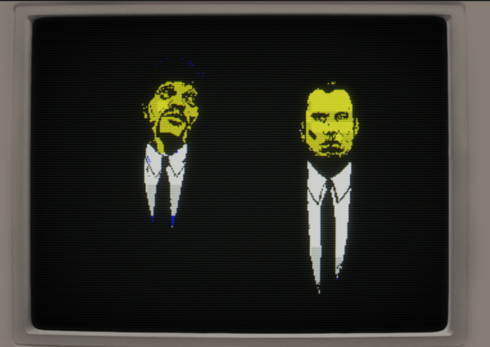
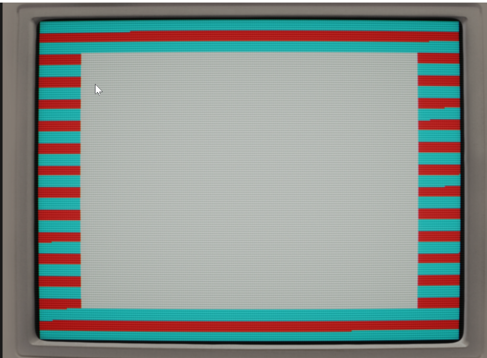

# ZX-Like

A ZX Spectrum-like library built for "[dos-like](https://github.com/mattiasgustavsson/dos-like/)" by Mattias Gustavsson.

It allows for the creation of ZX Spectrum like screens for demos, games or simply for the fun of tinkering with our color-clashing, rubber-keyed pal!

## Features

- ZX Spectrum ULA screen rendering (256x192 with 32x24 attribute cells)
- Timex "[hicolor](https://wiki.specnext.dev/Video_Modes#Timex_Sinclair_Hi-Color_Mode)" mode (256x192 screen with 32x192 attribute cells)
- Timex "[hires](https://wiki.specnext.dev/Video_Modes#Timex_Sinclair_Hi-Res_Mode)" mode (512x192 1 bit colour screen)
- [ULAplus](https://zxdesign.itch.io/ulaplus) palette support
- ZX-Uno's "[Radastan](https://wiki.specnext.dev/Video_Modes#LoRes_Layer.2FRadasjimian_Mode)" mode (128x96 4bpp color)
- SCR file loading

The screen buffers are stored in the same formats as the simulated screen modes, so you will have to learn how they work! Dean Belfield's got a great [primer](http://www.breakintoprogram.co.uk/computers/zx-spectrum/screen-memory-layout) on the subject if you're unsure of where to start.

## Building

See "[dos-like](https://github.com/mattiasgustavsson/dos-like/)" for the main instructions - just replace `dos.c` with `zx.c`.

Your program will launch into `zxmain`. See the `zxdemo.c` for example usage.

## Art Credits

- This demo uses [key art](https://www.youtube.com/watch?v=Oe9NyMEraJA) by MORPHINE Music. I liked the image and was keen to see how the Speccy could handle it.
- [Cyberpunk 2077](https://www.cyberpunk.net/gb/en/) is (c) 2020 CD Projekt Red
- Django Unchained is (c) 2012 Sony Pictures
